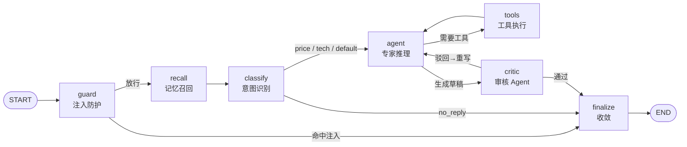
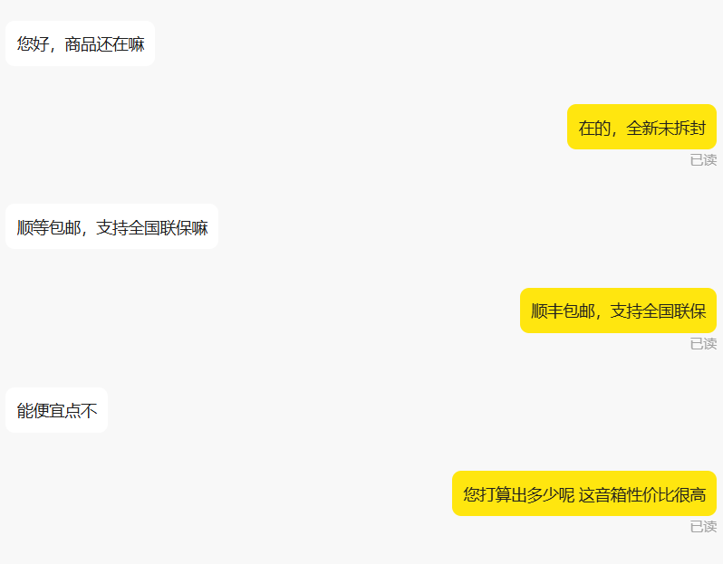
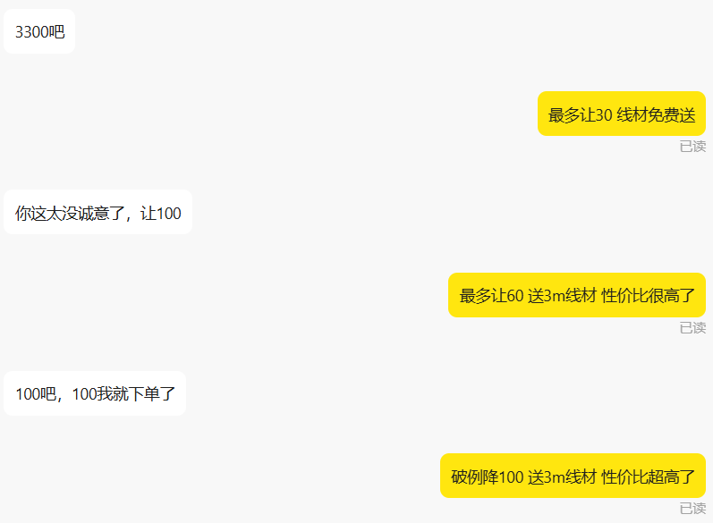
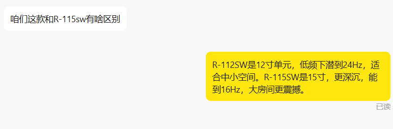

# 🐟 KoiAgent - 智能客服值守机器人

KoiAgent 是一套面向电商平台客服场景的 **AI 值守解决方案**，实现 7×24 小时自动化值守，支持多专家协同决策、智能议价与上下文感知对话。

## 🌟 核心特性

### 智能对话引擎
| 功能模块   | 技术实现                     | 关键特性                                                     |
| ---------- | ---------------------------- | ------------------------------------------------------------ |
| 上下文感知 | LangGraph Checkpointer 记忆  | 以会话 ID 作为 thread_id 持久化多轮对话与工具调用轨迹         |
| 专家路由   | LangGraph 状态图 + 混合路由  | 规则优先、LLM 结构化输出兜底；专家 Agent 以状态图节点编排      |
| 工具调用   | Function Calling             | 议价策略 / 知识库检索 / 时间查询由模型自主调度                |
| 推理循环   | ReAct（思考→行动→观察）     | Agent 与 ToolNode 循环，超出最大步数自动收敛                  |
| 知识检索   | RAG（Embedding + 向量索引）  | 向量检索优先，未配置 Embedding 时自动降级关键词检索            |

### 业务功能矩阵
| 模块     | 已实现                          | 规划中                         |
| -------- | ------------------------------- | ------------------------------ |
| 核心引擎 | ✅ LLM 自动回复<br>✅ 上下文管理 | 🔄 情感分析增强                 |
| 记忆系统 | ✅ 短期摘要压缩<br>✅ 长期事实召回<br>✅ 用户画像<br>✅ 工具结果缓存 | 🔄 记忆冲突消解<br>🔄 记忆导入导出 |
| 协作机制 | ✅ 专家路由<br>✅ 审核 Agent 反思重写 | 🔄 多专家辩论仲裁            |
| 生态集成 | ✅ MCP Server（4 个能力）       | 🔄 更多 MCP 客户端适配         |
| 安全防护 | ✅ Prompt 注入防护<br>✅ 站外联系拦截 | 🔄 敏感词库热更新              |
| 议价系统 | ✅ 阶梯降价策略（配置文件驱动 + 热更新） | 🔄 市场比价功能          |
| 技术支持 | ✅ RAG 知识库检索（向量/关键词 + 热更新） | 🔄 多模态问答           |
| 订单履约 | ✅ 订单事件钩子（待付款 / 关闭 / 待发货） | 🔄 自动发货提醒<br>🔄 评价引导 |
| 运维监控 | ✅ 全链路追踪（含轮转）<br>✅ 指标与成本统计<br>✅ 启动期配置校验<br>✅ 健康检查 | 🔄 钉钉告警<br>🔄 Web 管理台 |
| 稳定性   | ✅ 幂等去重<br>✅ 熔断降级<br>✅ 并发限流<br>✅ 出站限速 | 🔄 多实例部署<br>🔄 分布式记忆 |

## 🧠 Agent 架构

编排层基于 **LangGraph** 构建，将客服流程建模为一张有状态图：



> 📚 **深入阅读**
> - [`docs/ARCHITECTURE.md`](./docs/ARCHITECTURE.md) —— 架构说明：模块职责、设计决策与取舍、请求全链路
> - [`docs/INTERVIEW_QA.md`](./docs/INTERVIEW_QA.md) —— 设计问答手册：40 个高频技术问题的深度回答

**技术栈**

| 能力 | 实现 |
| ---- | ---- |
| 状态图编排 | `langgraph` `StateGraph` + 条件边 |
| 意图路由 | 关键词/正则规则优先 → LLM 结构化输出（Pydantic `IntentDecision`）兜底 |
| **记忆系统** | 短期摘要压缩 + 长期事实召回 + 用户画像 + 工具结果缓存；写回后台异步执行 |
| **可热更新配置** | 议价策略（JSON）与知识库（文件指纹检测）改动后无需重启 |
| **配置校验** | 启动期声明式 schema 校验，配置填错 **启动即失败**（而非运行到一半才崩） |
| 工具调用 | `bind_tools` + `ToolNode`，由模型自主调度 |
| 知识检索 | RAG：Embedding（OpenAI 兼容）+ numpy 余弦检索；向量缓存落盘，未配置时降级关键词检索 |
| ReAct 循环 | `agent ⇄ tools` 循环，`AGENT_MAX_STEPS` 上限保护 |
| 多 Agent 协作 | 生产者-审核者（Producer-Critic）：独立审核 Agent 复核草稿，「驳回→带反馈重写」构成 **Reflexion 反思循环**，`AGENT_MAX_REFLECTIONS` 限制返工轮数 |
| MCP 协议 | 以 `MCPServer` 暴露 4 个能力（3 个纯工具 + 完整 Agent 委派），支持 stdio / streamable-http |
| 并发模型 | 全异步：节点 `ainvoke` + `graph.ainvoke`，LLM 请求不阻塞事件循环 |
| 可靠性 | 幂等去重 / 熔断降级（失败返回兜底话术）/ 并发限流 / 会话记忆 TTL+LRU 淘汰 / **出站限速** |
| 对话记忆 | `MemorySaver` Checkpointer，`thread_id = chat_id` |
| **记忆系统** | **四层记忆**：短期（窗口+摘要压缩）/ 长期（跨会话事实，按相关度召回）/ 用户画像（预算·意向·议价风格）/ 工具记忆（结果缓存 + 调用记录） |
| 提示词 | 按意图动态装载 `prompts/*_example.txt` 专家角色提示词 |
| 安全护栏 | **输入侧** Prompt 注入防护（归一化 + 加权规则 + 风险分级，命中直达拦截）；**输出侧**关键词过滤拦截站外联系方式 |
| 可观测性 | 全链路 Trace + 指标聚合 + Token/成本统计，Callback 零侵入采集，可选 Langfuse |

**内置工具**

| 工具 | 作用 |
| ---- | ---- |
| `get_bargain_policy(bargain_count)` | 按议价轮次返回阶梯让步策略 |
| `search_knowledge_base(query)` | 检索 `knowledge/` 本地知识库 |
| `get_current_time()` | 获取当前时间，回答发货时效 |

**可靠性设计**

| 机制 | 说明 |
| ---- | ---- |
| 幂等去重 | LRU + TTL 去重窗口，重连 / 重复推送不会重复回复 |
| 熔断降级 | 连续失败达阈值即熔断，直接返回**兜底话术**而非静默无响应 |
| 并发限流 | `asyncio.Semaphore` 限制同时推理数，平抑瞬时并发 |
| 记忆治理 | Checkpointer 会话按 TTL + LRU 淘汰，防止长跑进程内存无限增长 |
| 出站限速 | 令牌桶控制发送速率，防止模型响应过快导致连续发消息触发平台风控 |
| 轨迹轮转 | `traces.jsonl` 按大小轮转，避免长跑进程写满磁盘后**静默失效** |

## 🧩 记忆系统

Agent 的记忆不是单一机制，而是四类职责不同的存储。它们回答的是**四个不同的问题**：

| 记忆类型 | 回答什么问题 | 生命周期 | 注入方式 | 实现 |
| -------- | ------------ | -------- | -------- | ---- |
| **短期记忆** | 这段对话刚才说了什么？ | 单会话 | 摘要 + 原文窗口 | `memory/short_term.py` |
| **长期记忆** | 这个买家历来是什么情况？ | 跨会话 | 按查询相关度召回 Top-K | `memory/long_term.py` |
| **用户画像** | 这个买家是什么样的人？ | 跨会话 | 每轮全量注入 | `memory/profile.py` |
| **工具记忆** | 这个工具刚才是怎么答的？ | 单会话 | 不进提示词（省成本） | `memory/tool_memory.py` |

**几个关键设计点**

- **摘要压缩而非硬截断**：滑出窗口的历史被 LLM 压成摘要（**增量累积**，每条消息只被摘要一次），而不是直接丢弃。
- **读同步、写异步**：召回必须在生成前完成（本地 SQLite 查询，无 LLM 调用）；写入抽取是一次额外 LLM 调用，因此放到回复之后的**后台任务**，买家不必多等一秒。
- **成本优化**：长期记忆与画像合并为**一次**抽取调用；短输入（如“好的”）直接跳过抽取；三次 LLM 调用被压成一次。
- **陈旧记忆的保护**：提示词中明确要求「记忆与买家当前说法冲突时以当前说法为准」，避免拿旧信息反驳买家。
- **注入不污染记忆**：被注入防护拦截的输入不会写入记忆，否则攻击载荷会被持久化。

启停与调参：`MEMORY_ENABLED` 为总开关；`MEMORY_TOP_K` / `MEMORY_SUMMARY_TRIGGER` / `TOOL_MEMORY_TTL` 等见 `.env.example` 的「Agent 记忆系统」章节。

## 🎨 效果图
<div align="center">
  
  <br>
  <em>图1: 客服随叫随到</em>
</div>

<div align="center">
  
  <br>
  <em>图2: 阶梯式议价</em>
</div>

<div align="center">
  
  <br>
  <em>图3: 技术专家上场</em>
</div>

### 运行日志与指标（真实输出）

```text
2026-09-11 21:14:34.352 | INFO | koiagent.agent.graph:__init__:180 - KoiAgent 图已编译完成，工具: ['get_bargain_policy', 'search_knowledge_base', 'get_current_time'], 最大推理步数: 4
2026-09-11 21:14:34.353 | INFO | koiagent.rag.knowledge:reload:202 - RAG 运行于【关键词检索】模式，已加载 2 个知识片段
2026-09-11 21:14:34.364 | INFO | koiagent.agent.graph:_classify:282 - [classify] 意图=price（路由: rule）
2026-09-11 21:14:34.367 | INFO | koiagent.agent.graph:_agent:322 - [agent] step=1, tool_calls=无
2026-09-11 21:14:34.371 | INFO | koiagent.agent.graph:_critic:366 - [critic] 草稿审核通过
2026-09-11 21:14:34.388 | WARNING | koiagent.agent.graph:_guard:227 - [guard] 拦截疑似 Prompt 注入 (score=10, 命中=['指令覆盖', '提示词探测'])

──────── KoiAgent 运行指标 ────────
总运行次数   : 3
错误次数     : 0 (错误率 0.00%)
平均耗时     : 10.63 ms
P95 耗时     : 20.16 ms
意图分布     : {'price': 1, 'tech': 2}
拦截注入     : 1
────────────────────────────────────
```

## 🚴 快速开始

### 环境要求
- Python 3.10+（依赖 langgraph / langchain 的最新版本要求）

### 安装步骤
```bash
1. 克隆仓库
git clone https://github.com/Xiao-Snake123/KoiAgent.git
cd KoiAgent

2. 安装依赖
pip install -r requirements.txt

3. 配置环境变量
复制 .env.example 为 .env，并填写以下内容：
```

```dotenv
# 必配配置
API_KEY=apikey通过模型平台获取
COOKIES_STR=填写网页端获取的cookie
MODEL_BASE_URL=模型地址
MODEL_NAME=模型名称

# 可选配置
TOGGLE_KEYWORDS=接管模式切换关键词，默认为句号（输入句号切换为人工接管，再次输入则切换AI接管）
SIMULATE_HUMAN_TYPING=False  # 模拟人工回复延迟

# Agent 编排（可选）
AGENT_MAX_STEPS=4       # ReAct 最大推理步数
AGENT_MAX_MESSAGES=20   # 单次送入模型的最大历史消息数
AGENT_MAX_REFLECTIONS=1 # 审核驳回后的最大返工轮数
CRITIC_ENABLED=true     # 是否启用审核 Agent
KNOWLEDGE_DIR=knowledge # 本地知识库目录

# RAG 向量检索（可选，留空 EMBEDDING_MODEL 则自动使用关键词检索）
EMBEDDING_MODEL=        # 如 text-embedding-v3
EMBEDDING_BASE_URL=     # 留空回退 MODEL_BASE_URL
EMBEDDING_API_KEY=      # 留空回退 API_KEY
RAG_TOP_K=3             # 返回片段数
RAG_CHUNK_SIZE=300      # 切片长度
RAG_CHUNK_OVERLAP=60    # 切片重叠

# 输入侧 Prompt 注入防护（可选）
GUARD_ENABLED=true      # 关闭注入防护
GUARD_BLOCK_SCORE=5     # 拦截阈值（命中权重累加）
GUARD_MAX_INPUT=1000    # 最大输入长度，超出截断

# 可靠性（可选）
LLM_MAX_CONCURRENCY=4        # LLM 并发上限
CIRCUIT_FAILURE_THRESHOLD=5  # 连续失败几次后熔断
CIRCUIT_RESET_TIMEOUT=60     # 熔断冷却秒数
FALLBACK_REPLY=稍等，我确认下再回复您  # 降级兜底话术
DEDUP_TTL=300                # 消息去重窗口（秒）
MEMORY_MAX_THREADS=500       # 会话记忆最大 thread 数
MEMORY_TTL=7200              # 会话记忆空闲淘汰（秒）

# 可观测性与稳定性（可选）
TRACE_ENABLED=true      # 关闭追踪
TRACE_DIR=logs          # Trace 与指标输出目录
LLM_TIMEOUT=30          # 单次 LLM 请求超时（秒）
LLM_MAX_RETRIES=2       # LLM 请求失败重试次数
HEALTH_FILE=data/health.json  # 健康检查心跳文件
```

> 📘 **完整配置项（含逐项中文备注、模型选择建议、各厂商接入示例）见 [`.env.example`](./.env.example)。**
> 最小可用配置只需两项：`API_KEY`（模型密钥）与 `COOKIES_STR`（闲鱼网页端 Cookie）。

> - 默认使用**通义千问**，如需使用其他 API，请自行修改 `.env` 文件中的模型地址和模型名称；
> - `COOKIES_STR` 请在闲鱼网页端获取（网页端 F12 打开控制台，选择 Network，点击 Fetch/XHR，点击一个请求，查看 cookies）。

```bash
4. 准备提示词文件
prompts/*_prompt.txt 可直接删除模板名称中的 _example 得到，否则默认读取四个提示词模板中的内容
```

### 使用方法

运行主程序：
```bash
python -m koiagent     # 推荐
# 或（等价）
python main.py
```

### 自定义提示词

可以通过编辑 `prompts` 目录下的文件来自定义各个专家的提示词：

- `classify_prompt.txt`: 意图分类提示词
- `price_prompt.txt`: 价格专家提示词
- `tech_prompt.txt`: 技术专家提示词
- `default_prompt.txt`: 默认回复提示词
- `critic_prompt.txt`: 审核 Agent 提示词（质检维度与判定规则）

## 📁 目录结构

```
KoiAgent/
├── koiagent/                     # 主包
│   ├── __init__.py               # 包元信息（__version__ / 分层说明）
│   ├── __main__.py               # 入口：python -m koiagent
│   ├── app.py                    # 应用装配：WebSocket 长连 / 心跳 / Token 刷新 / 人工接管
│   ├── config.py                 # 配置加载 / 声明式 schema 校验 / 缺失配置交互式补全
│   ├── agent/                    # Agent 编排层
│   │   ├── graph.py              #   LangGraph 状态图 guard→recall→classify→agent⇄tools→critic
│   │   ├── tools.py              #   Function Calling 工具集（接入工具记忆缓存）
│   │   ├── guard.py              #   输入侧 Prompt 注入防护
│   │   └── bargain.py            #   议价策略（JSON 驱动 + 热更新）
│   ├── memory/                   # 记忆系统
│   │   ├── store.py              #   SQLite 存储层（memories / user_profiles / tool_calls）
│   │   ├── short_term.py         #   短期记忆：窗口 + 增量摘要压缩
│   │   ├── long_term.py          #   长期记忆：事实抽取 / 相关度召回 / 衰减淘汰
│   │   ├── profile.py            #   用户画像：结构化属性 + 增量合并
│   │   ├── tool_memory.py        #   工具记忆：会话级结果缓存 + 调用记录
│   │   └── manager.py            #   门面：recall / remember / 上下文渲染
│   ├── rag/
│   │   └── knowledge.py          # RAG 检索层（向量 / 关键词双模式 + 缓存 + 热更新）
│   ├── platform/
│   │   ├── api.py                #   平台 HTTP 接口（登录 / Token / 商品）
│   │   └── protocol.py           #   协议工具（Cookie / 签名 / MessagePack 解码）
│   ├── infra/
│   │   ├── observability.py      #   全链路 Trace（含轮转）/ 指标聚合 / Token 与成本
│   │   ├── resilience.py         #   幂等去重 / 熔断 / 并发限流 / 记忆治理 / 出站限速
│   │   ├── text.py               #   共享文本工具（分词 / 归一化 / 稳定哈希）
│   │   └── prompts.py            #   提示词加载（自定义 → 示例 → 内置默认）
│   ├── storage/
│   │   └── context.py            #   SQLite 业务数据（议价次数 / 商品缓存）
│   ├── mcp/
│   │   └── server.py             #   MCP Server
│   └── ops/
│       ├── healthcheck.py        #   容器健康检查
│       └── order_events.py       #   订单事件钩子（待付款 / 关闭 / 待发货）
├── main.py                       # 兼容入口（等价于 python -m koiagent）
├── config/
│   └── bargain_policy.json       # 议价阶梯策略（可改，热更新生效）
├── docs/                         # 设计文档
│   ├── ARCHITECTURE.md           #   架构说明与设计决策
│   └── INTERVIEW_QA.md           #   设计问答手册
├── knowledge/                    # 本地知识库（供 search_knowledge_base 检索）
├── prompts/                      # 提示词模板（专家角色 / 审核 / 记忆抽取）
├── eval/                         # 评估 Harness（评估集 + runner + 报告）
├── tests/                        # pytest 单元测试
├── .github/workflows/            # CI 流水线（编译 + 测试 + 评估门禁）
├── images/                       # 演示图片
├── pyproject.toml                # 工具配置（pytest）
├── requirements.txt              # 运行时依赖
├── requirements-dev.txt          # 开发/测试依赖
├── Dockerfile
└── docker-compose.yml
```

## 🐳 Docker 部署
```bash
# 先准备 .env 与 prompts/*.txt
docker compose up -d
```

## 🔌 MCP 集成

项目内置 **MCP Server**，可把能力暴露给 Claude Desktop / Cursor 等任意 MCP 客户端。

```bash
python -m koiagent.mcp.server                             # stdio（桌面客户端默认）
python -m koiagent.mcp.server --transport streamable-http # HTTP 传输
```

**暴露的能力**

| 工具 | 作用 | 需要 LLM |
| ---- | ---- | ---- |
| `get_bargain_policy` | 按议价轮次返回阶梯让步策略 | 否 |
| `search_knowledge_base` | RAG 检索本地知识库 | 否 |
| `get_current_time` | 当前服务器时间 | 否 |
| `ask_koi_agent` | 委派完整 Agent 图处理并返回可直接发送的回复 | 是 |

**客户端配置**（`claude_desktop_config.json`）

```json
{
  "mcpServers": {
    "koi-agent": {
      "command": "python",
      "args": ["-m", "koiagent.mcp.server"],
      "cwd": "/path/to/KoiAgent"
    }
  }
}
```

> 💡 三个纯工具**无需 API Key** 即可离线使用；只有 `ask_koi_agent` 需要配置模型 API，
> 未配置时返回明确提示而非报错。stdio 传输下日志被强制重定向到 stderr，保证协议帧独占 stdout。

## 🧪 质量保障

### 单元测试

```bash
pip install -r requirements-dev.txt
pytest
```

覆盖：Prompt 注入防护、意图路由、Function Calling 工具、RAG 双模式与缓存、可观测性、LangGraph 图结构与异步执行。

### 评估 Harness

```bash
python eval/run_eval.py             # 离线：规则路由 + RAG 检索
python eval/run_eval.py --with-llm  # 追加 LLM 路由兜底评估（需 API_KEY）
```

产出 `eval/report.md` 评估报告；未达 `--min-intent-acc` / `--min-retrieval-hit` 阈值时返回非 0 退出码，可**直接作为 CI 质量门禁**。

### 可观测性

| 产物 | 内容 |
| ---- | ---- |
| `logs/traces.jsonl` | 每次运行的意图 / 路由方式 / 工具调用序列 / 推理步数 / 耗时 / Token / 成本 / 异常 |
| `logs/metrics.json` | 累计运行数、错误率、平均与 P95 耗时、意图分布、工具分布、Token 与成本 |

程序退出时自动打印指标报告；配置 `LANGFUSE_*` 且安装 `langfuse` 后可自动上报。

### 持续集成

`.github/workflows/ci.yml` 在每次 push / PR 时执行：
**字节编译校验 → 单元测试 → 评估门禁**（未达阈值直接失败），并上传评估报告为构建产物。

### 容器健康检查

worker 类容器没有 HTTP 端口，因此采用**心跳文件探活**：主程序在连接建立与每次心跳响应成功时
刷新 `data/health.json`；`HEALTHCHECK` 每分钟调用 `python -m koiagent.ops.healthcheck` 校验其新鲜度
（默认 180s 内视为健康，可用 `HEALTH_MAX_AGE` 调整）。

## 🛡 免责声明

⚠️ 本项目仅供**学习与交流**使用，请遵守平台相关服务条款。使用本项目所产生的一切后果由使用者自行承担。

## 📄 开源协议

本项目基于 [GNU General Public License v3.0](./LICENSE) 发布。
